# CabCoPilot


A minimal, **local** voice-to-voice prototype designed specifically for the Ola driver support scenario. This system provides a complete Hindi-language voice interaction pipeline with push-to-talk functionality.

## 🌟 Key Features

- **End-to-end Hindi voice interaction** - Speech recognition and synthesis entirely in Hindi
- **Local processing** - Works offline without cloud dependencies (except optional LLM)
- **Push-to-talk interface** - Simple interaction model for drivers
- **Deterministic conversation flow** - FSM ensures consistent scenario compliance
- **Low-latency response** - Optimized for quick interactions in noisy environments
- **Configurable components** - Easily adjust ASR model size and other parameters

## 🎯 Use Case

Designed specifically for Ola drivers experiencing issues with ride requests. The system guides drivers through a structured support conversation:

1. Driver reports not receiving rides despite being online
2. System verifies the driver's registered number
3. System confirms the number isn't blocked
4. System suggests changing location to find more rides
5. Conversation concludes with driver acknowledgment

## 🔄 Scenario Flow (Hindi)

```mermaid
sequenceDiagram
    participant D as Driver
    participant S as System
    D->>S: "मैं 2 घंटे से ऑनलाइन हूँ पर मुझे कोई राइड नहीं मिल रही।"
    S->>D: "ओला कस्टमर सपोर्ट में आपका स्वागत है। क्या यह आपका रजिस्टर्ड नंबर है?"
    D->>S: "हाँ, यह मेरा रजिस्टर्ड नंबर है।"
    S->>D: "आपका नंबर ब्लॉक नहीं है। सब ठीक है।"
    S->>D: "कृपया अपना लोकेशन बदल कर फिर से राइड्स चेक कीजिए।"
    D->>S: Acknowledges
    S->>D: Call ends
```



The finite-state machine (FSM) enforces this exact conversation path while gracefully handling minor deviations with clarification prompts.

## 🏗️ System Architecture

```
┌─────────────┐    ┌──────────────┐    ┌─────────────┐    ┌─────────────┐    ┌─────────────┐
│   Microphone│───▶│ Audio Recorder│───▶│ ASR         │───▶│ Intent      │───▶│ Conversation│
│             │    │ (sounddevice)│    │(faster-     │    │Classifier   │    │ FSM         │
└─────────────┘    └──────────────┘    │whisper)     │    │             │    └─────────────┘
                                        └──────────────┘    └─────────────┘           │
                                              │                    │                │
                                              ▼                    ▼                ▼
                                        ┌──────────────┐    ┌─────────────┐    ┌─────────────┐
                                        │ Transcribed  │    │ Intent      │    │ Response    │
                                        │ Hindi Text   │    │ Label       │    │ Generator   │
                                        └──────────────┘    └─────────────┘    └─────────────┘
                                                                       │                │
                                                                       ▼                ▼
                                                                ┌─────────────┐    ┌─────────────┐
                                                                │ TTS         │    │ Audio       │
                                                                │ (gTTS)      │───▶│ Player      │
                                                                └─────────────┘    │(sounddevice)│
                                                                                    └─────────────┘
```

### Core Components

- **Audio Input/Output**: `sounddevice` for recording (16kHz mono) and playback
- **ASR**: `faster-whisper` with Hindi language forcing
- **Intent Classification**: Lightweight heuristics with optional OpenRouter LLM fallback
- **Conversation Management**: Deterministic finite-state machine (`VoiceBotFSM`)
- **Response Generation**: Pre-scripted Hindi lines for assessment compliance
- **TTS**: `gTTS` → MP3 → WAV conversion via `pydub`

## 🚀 Quick Start

### Prerequisites

- Python 3.10 or higher
- FFmpeg (for audio processing)
- Microphone access and speakers

### Installation

1. **Clone the repository**
   ```bash
   git clone https://github.com/your-username/voice-bot-assessment.git
   cd voice-bot-assessment
   ```

2. **Install system dependencies**
   ```bash
   # Ubuntu/Debian
   sudo apt-get install ffmpeg
   
   # macOS (Homebrew)
   brew install ffmpeg
   
   # Windows (Chocolatey)
   choco install ffmpeg
   ```

3. **Set up environment**
   ```bash
   cp .env.example .env
   # Edit .env to set your preferences (optional)
   ```

4. **Install Python dependencies**
   ```bash
   ./run.sh
   # Or manually:
   python -m venv .venv
   source .venv/bin/activate  # On Windows: .venv\Scripts\activate
   pip install -r requirements.txt
   ```

> **Note**: The first ASR run will download the Whisper model (default: `base`). For low-end devices, set `ASR_MODEL_SIZE=tiny` in `.env`.

### Running the Application

```bash
python src/main.py
```

**How to use:**
1. Press **Enter** to start talking (push-to-talk)
2. Speak in Hindi for up to 8 seconds
3. The system will transcribe, process, and respond in Hindi
4. Repeat until the conversation completes

**Tips for best results:**
- Keep the microphone close to your mouth
- Speak clearly in a quiet environment
- Background noise (like ceiling fans) can affect accuracy

## ⚙️ Configuration

Configure the system by editing the `.env` file:

| Variable | Options | Description |
|----------|---------|-------------|
| `ASR_MODEL_SIZE` | `tiny`, `base`, `small`, `medium`, `large-v3` | Whisper model size (tiny for low-end devices) |
| `TTS_PROVIDER` | `gtts` | Text-to-speech provider |
| `OPENROUTER_API_KEY` | (your API key) | Enables LLM-assisted intent classification |
| `OPENROUTER_MODEL` | `openrouter/auto` | LLM model for intent classification |

## 🧪 Testing

Run the test suite to verify FSM compliance:

```bash
pytest -q
```

The tests cover all state transitions and conversation paths to ensure assessment requirements are met.

## 🔧 Troubleshooting

| Issue | Solution |
|-------|----------|
| **No audio device / permission denied** | • macOS: Grant Terminal mic access in System Settings<br>• Linux: Use `pavucontrol` to select correct input device<br>• Windows: Check mic privacy settings |
| **`ImportError: No module named 'faster_whisper'`** | Re-run `pip install -r requirements.txt`. On Apple Silicon, ensure Python 3.10+ |
| **ASR too slow / high RAM usage** | Set `ASR_MODEL_SIZE=tiny` in `.env`. Close other memory-intensive applications |
| **TTS fails: `ffmpeg not found`** | Install FFmpeg following the setup instructions |
| **gTTS fails due to internet issues** | Connect to internet or replace with an offline TTS provider (e.g., Coqui TTS) |

## 🎥 Demo Recording

To create a demo video:

1. Use screen recording software (OBS, QuickTime, etc.)
2. Record while running `python src/main.py`
3. Demonstrate:
   - The happy path conversation flow
   - A deviation and recovery scenario
4. Save as `demo.mp4` in the project root

## 📁 Project Structure

```
voice-bot-assessment/
├── .env.example              # Environment variables template
├── .gitignore               # Git ignore rules
├── diagrams/                # Architecture diagrams
│   └── architecture.png     # System architecture diagram
├── requirements.txt         # Python dependencies
├── run.sh                   # Setup script
├── src/                     # Source code
│   ├── assets/              # System prompts
│   │   └── prompt_system_hi.txt
│   ├── audio_io.py          # Audio recording/playback
│   ├── config.py            # Configuration management
│   ├── conversation_fsm.py  # Conversation state machine
│   ├── llm.py               # LLM integration
│   ├── main.py              # Application entry point
│   ├── stt.py               # Speech-to-text
│   └── tts.py               # Text-to-speech
├── tests/                   # Test suite
│   └── test_fsm.py          # FSM tests
└── README.md                # This file
```

## ❓ Why a Deterministic FSM?

The assessment requirements demand:
1. **Exact conversation flow** - No deviations from the specified script
2. **Full Hindi interaction** - All communication must be in Hindi
3. **Low latency** - Quick responses for driver convenience

A deterministic FSM provides:
- **Guaranteed scenario accuracy** - Always follows the required conversation path
- **Predictable performance** - Consistent response times without heavy NLG processing
- **Graceful error handling** - Can manage unexpected inputs with brief clarifications

For production use, we would enhance this with:
- A hybrid policy model combining FSM with intent recognition
- More natural TTS voices
- Expanded conversation capabilities
- Additional driver support scenarios

## 📝 Notes for Reviewers

- The conversation is **100% Hindi** as required by the assessment
- Voice-to-voice realism is limited by the TTS choice (gTTS)
- Typical response latency is under 2 seconds with base/tiny ASR models
- The FSM ensures the exact script flow: greeting → number verification → status check → location suggestion → goodbye
- The system has been tested with Indian accents and in noisy environments (Pune/Solapur context)

## 🤝 Contributing

Contributions are welcome! Please feel free to submit a Pull Request. For major changes, please open an issue first to discuss what you would like to change.

```
   - Added context for design decisions (FSM explanation)

This improved README provides a much clearer, more professional presentation of your project while maintaining all the essential information from the original version.
